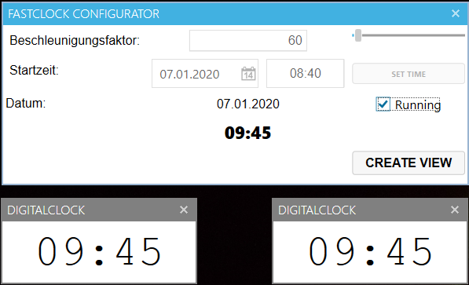
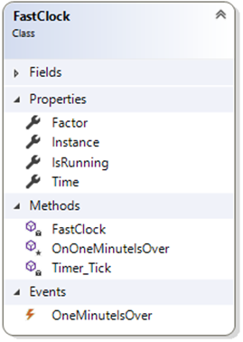

# FastClock mit Events

# Lernziele

* Events

# Beschreibung

## Allgemein

Es ist eine schnell laufende Uhr (`FastClock`) zu realisieren, die von beliebig vielen Anzeigen (DigitalClock) "beobachtet" wird:

`FastClock` ist dabei in der Logikschicht derart zu verwalten, dass sowohl der Faktor, um den die Uhr schneller läuft, als auch Startdatum und Startzeit einstellbar sind. Über das Event `OneMinuteIsOver` werden alle angemeldeten Views (`Observer`) verständigt, sobald sich die Minute verändert hat. Die Uhr kann bei Bedarf auch angehalten werden (Property `IsRunning` in Klasse `FastClock`, bzw Checkbox Running in GUI zum Setzen der Property).

## Anforderungen

* Realisierung als Zweischichtanwendung mit GUI und Logik.
* Für den Timer im Logikprojekt die Klasse `DispatcherTimer` verwenden. Siehe dazu die die [Microsoft Dokumentation](https://docs.microsoft.com/en-us/dotnet/api/system.windows.threading.dispatchertimer?view=netcore-3.0).
* Das Timerintervall des `DispatcherTimer`-Objekts ist so einzustellen, dass es auslöst, wenn für die `FastClock` eine Minute vergangen ist (dann kann in der `FastClock` einfach eine Minute dazugezählt werden)
    * Das kürzeste mögliche Intervall ist 1 (1 ms == 1 Minute), das längste Intervall lässt die Uhr in Normalgeschwindigkeit laufen (`Beschleunigungsfaktor` von 1). Ein `Beschleunigungsfaktor` von 2 würde die Noralzeit doppelt so schnell laufen lassen. Dh. eine Minute würde in der `FastClock` nur eine halbe Minute (30 Sekunden) "dauern".
* Die `FastClock` ist als `Singleton` ([Dokumentation](https://wiki.byte-welt.net/wiki/Singleton_Beispiele_(Design_Pattern))) zu implementieren, damit alle Beobachter die selbe Uhrzeit haben.

## Eventhandler

Als Basis für den Event soll ein generischer `EventHandler<DateTime>` verwendet werden.

## Spezialistenaufgabe
* Spezialisten erzeugen eine Analoguhr als alternativen Observer.

